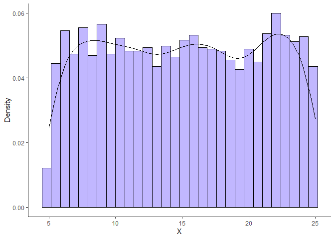
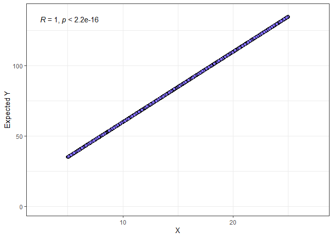
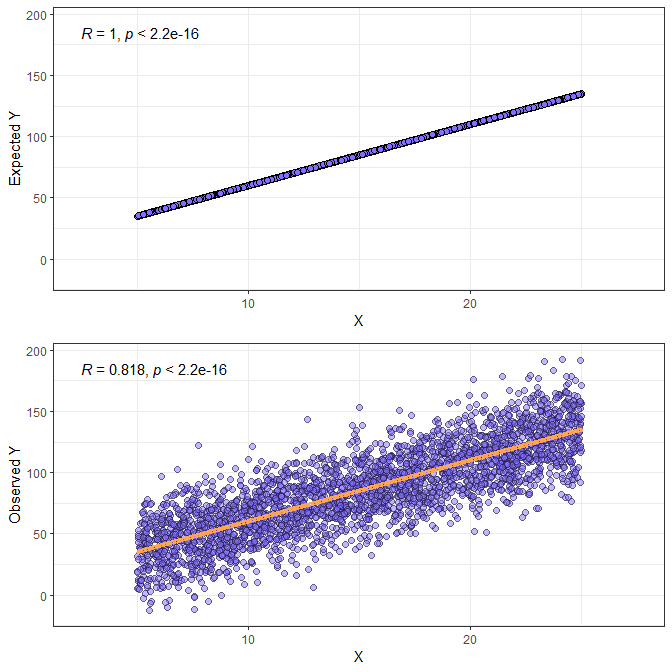
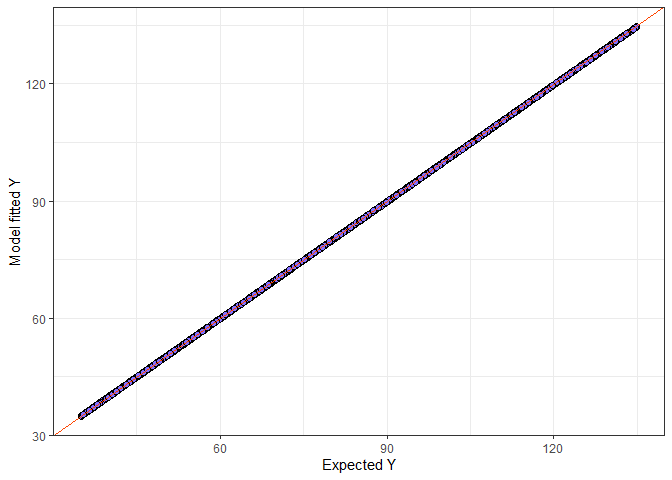

# Simulating data for simple linear regression
Marc A. Beer
=======================
<br> <font size="5"> Simple linear regression is useful for
understanding the relationship between an unbounded continuous response
variable and one or more explanatory variables. Simple relationships are
also relatively easy to simulate in R. </font> <br><br>

<font size="4"> Before we begin, let’s load in some useful R packages.
</font>

``` r
library(lme4)
library(lmerTest)
library(rstanarm)

library(ggplot2)
library(patchwork)
library(cowplot)
library(ggpubr)
library(knitr)
```

<br>

## 1. Simulating an X variable

<br> <font size="4"> We might simulate an explanatory or “X” variable by
making a random draw of size N from a uniform distribution governed by
specified minimum and maximum values. </font>

``` r
set.seed(2)

#set a sample size
N <- 3000

#draw from a uniform distribution with specified min and max values
xmin <- 5
xmax <- 25
x <- runif(n=N, min=xmin, max=xmax)
```

<br><br> <font size="4"> Let’s plot the resulting random draw as a
histogram. You’ll notice that the prevalence of X values is similar for
each bin, which is what we expect from a uniform distribution. </font>

``` r
ggplot(data.frame(x=x), aes(x = x)) + 
  geom_histogram(aes(y = ..density..),
                 colour = 1, fill = "slateblue1", bins=N/100, alpha=0.5) +
  geom_density()+
  labs(x="X", y="Density")+
  theme(panel.grid.major = element_blank(), panel.grid.minor = element_blank(),
panel.background = element_blank(), axis.line = element_line(colour = "black"))
```



<font size="4"> Note that we could have simulated X values using
different distributions, and it may be informative to play around with
this. For example, if we expect that extremely high or low X values will
be rarer than middling values (a sensible expectation), we might prefer
the normal distribution. </font> <br><br>

## 2. Simulating expected (mean) Y values

<br> <font size="4"> Great, we have our X values. Let’s simulate a
response variable Y that has a simple linear relationship with X. To do
this, we will need to specify a Beta coefficient (B) that relates X
values to mean, or expected, values of Y.

Note that we say a expected values of Y because we will later introduce
noise, or random error, to the expected Y value when we generate a
dataset mimicking real data. Thus, our final dataset containing
*observed* Y values will depart from these *expected* Y values. However,
we will see that the general trend, and indeed, the expected Y values,
will ultimately be preserved. </font>

``` r
#specify a beta coefficient
B <- 5
```

<br> <font size="4"> We can also specify an intercept (I) describing the
expected value of Y when X=0. </font>

``` r
#specify an intercept
I <- 10
```

<br> <font size="4"> Having specified a Beta coefficient (B) and
intercept (I), we can now calculate expected values of Y using a simple
function. We’ll call our expected values of Y “y_e” because we still
need to modify them somehow… </font>

``` r
#calculate expected values of y ("y_e")
y_e <- B*x + I
```

<br><br> <font size="4"> Let’s plot our expected values of Y in relation
to X. </font>

``` r
#create a data frame of x and y_e values
df_x_ye <- data.frame(x=x, y_e=y_e)

#plot expected y (y_e) against x
ggplot()+
  geom_point(data=df_x_ye, mapping=aes(x=x, y=y_e), shape=21, colour="black", fill="slateblue1", size=2)+
  xlim(min(x)-2.5, max(x)+2.5)+
  ylim(0, max(y_e)+2.5)+
  labs(x="X", y="Expected Y")+
  theme_bw()+
  stat_cor(data=df_x_ye, mapping=aes(x=x, y=y_e), method = "pearson")
```



<font size="4"> If you’ve carried out regression analysis on real data,
you might think these data are a bit odd. The correlation between X and
Y is \[likely\] unrealistically high. In fact, Pearson’s r = 1. X
perfectly predicts Y. However, recall that these are *expected* values
of Y. </font> <br>

<font size="4"> As mentioned earlier, real data concerning correlated
variables frequently show some magnitude of random error (or noise).
This random error can be introduced by measurement or simply the
randomness of nature itself, among other causes. We should introduce
random error to generate a more realistic dataset. </font> <br><br>

## 3. Adding random error (noise) to our expected values of y

<br> <font size="4"> Because random error is… random, it should preserve
the expected value of Y. That is, the error values added to each
expected Y value should be centered on zero. For simple linear
regression, we further assume that the random error is normally
distributed with constant variance (i.e., the error variance does not
depend on the expected value of y). We can generate random error by
drawing from a normal distribution with a mean value of zero and a
standard deviation governing the magnitude of variation in error values.
</font> <br>

<font size="4"> Here, I have specified the error standard deviation as
sqrt(var(y_e)/2), which is equivalent to specifying the error variance
as var(y_e)/2. More explicitly, we have set the error variance as half
of the variance in expected Y values (var(y_e)). We will return to this
in just a moment when we discuss how the addition of random error alters
the appearance of relationship between Y and X. </font>

``` r
set.seed(20)

#generate y values by adding random error to y_e
y <- y_e + rnorm(n=N, mean=0, sd=sqrt(var(y_e)/2))

#create new data frame merging x, ye, and y
df_x_ye_y <- data.frame(x=x, y_e=y_e, y=y)

#re-plot expected y (y_e) vs x
ye_plot<-ggplot()+
  geom_point(data=df_x_ye_y, mapping=aes(x=x, y=y_e), shape=21, colour="black", fill="slateblue1", size=2)+
  xlim(min(x)-2.5, max(x)+2.5)+
  ylim(min(y)-2.5, max(y)+2.5)+
  labs(x="X", y="Expected Y")+
  theme_bw()+
  stat_cor(data=df_x_ye_y, mapping=aes(x=x, y=y_e), method = "pearson")

#plot observed y vs x
y_plot<-ggplot()+
  geom_point(data=df_x_ye_y, mapping=aes(x=x, y=y), shape=21, colour="black", fill="slateblue1", size=2, alpha=0.5)+
  geom_line(data=df_x_ye_y, mapping=aes(x=x, y=y_e), colour="tan1", size=1.5)+
  xlim(min(x)-2.5, max(x)+2.5)+
  ylim(min(y)-2.5, max(y)+2.5)+
  labs(x="X", y="Observed Y")+
  theme_bw()+
  stat_cor(data=df_x_ye_y, mapping=aes(x=x, y=y), method = "pearson", digits=3)

#combine plots
cowplot::plot_grid(ye_plot, y_plot, nrow=2, ncol=1, vjust=-0.25)
```


<font size="4"> The top plot shows the relationship between expected
values of Y and X, which was plotted previously. The bottom plot shows
our new *observed* values of Y. </font> <br>

<font size="4"> We can see that considerable noise has been added to the
data, but the general trend has been preserved. Indeed, in the lower
plot, the orange line depicts the original expected Y values that we
simulated (also shown as points in the top plot). Note that the value of
Pearson’s r for the simulated observed Y values is now \~0.82; Pearson’s
r has decreased. </font> <br>

<font size="4"> Recall that when we added random error to the expected Y
values, we used a normal distribution with a standard deviation
sqrt(var(y_e)/2). By specifying the error variance as half the variance
of the expected Y values, we generated data where X can explain 2/3 of
variance in Y, with the remaining 1/3 governed by random error. How does
this relate to Pearson’s r? Pearson’s r is equal to the square root of
the variance in Y explained by X. By squaring Pearson’s r, we can
confirm that X explains 2/3 of the variance in y. Let’s do that now.
</font> <br>

``` r
#re-calculate the value for Pearson's r and confirm that it is the value shown in the lower panel of the above figure
pearson_r <- cor(x,y)

#square the value of Pearson's r and confirm that it is ~2/3
pearson_r_squared <- cor(x,y)^2

#print the values together
cat(paste("Pearson's r = ", pearson_r, "\n", "Squared Pearson's r = ", pearson_r_squared, sep=""))
```

    ## Pearson's r = 0.817767578544923
    ## Squared Pearson's r = 0.668743812519226

<font size="4"> Note that due to our finite sample size and the nature
of introducing randomness, we should expect some deviation from an exact
value of 2/3. However, if we repeated the entirety of the previous
sections numerous times and took the mean squared Pearson’s r across the
replicates, we should obtain a value *very* close to 2/3. </font>
<br><br>

<font size="5"> Congratulations! </font>

<font size="4"> We’ve successfully simulated an X variable and a Y
variable with added random error. In addition, we’ve managed to control
the amount of variance in Y explained by X and random error. This
experience is useful, for example in the context of doing a power
analysis when some preliminary information is known about the
relationships between different variables. </font> <br>

<font size="4"> We could stop here, or we could confirm that the
parameters we specified (B, I, y_e, and the error variance) can be
recovered using simple linear regression. Let’s do that now. </font>
<br><br>

## 4. Using a simple linear model to compare true and estimated parameter values

<br> <font size="4"> Base R allows us to carry out simple linear
regression using the function lm(). </font>

``` r
#carry out simple linear regression
mod1 <- lm(y ~ x, data=df_x_ye_y)
```

<br><br> <font size="4"> Now that we’ve created a linear model, we can
use the function summary() and the model name to get a - summary - of
the information specified and estimated in the model. </font>

``` r
#view model summary
summary(mod1)
```

    ## 
    ## Call:
    ## lm(formula = y ~ x, data = df_x_ye_y)
    ## 
    ## Residuals:
    ##     Min      1Q  Median      3Q     Max 
    ## -68.332 -13.870   0.052  13.836  73.649 
    ## 
    ## Coefficients:
    ##             Estimate Std. Error t value Pr(>|t|)    
    ## (Intercept) 10.00823    1.03658   9.655   <2e-16 ***
    ## x            4.98774    0.06411  77.797   <2e-16 ***
    ## ---
    ## Signif. codes:  0 '***' 0.001 '**' 0.01 '*' 0.05 '.' 0.1 ' ' 1
    ## 
    ## Residual standard error: 20.54 on 2998 degrees of freedom
    ## Multiple R-squared:  0.6687, Adjusted R-squared:  0.6686 
    ## F-statistic:  6052 on 1 and 2998 DF,  p-value: < 2.2e-16

<font size="4"> The summary includes details regarding coefficients,
which include the intercept (which we simulated under the name “I”) and
Beta coefficient for X (“B”). </font> <br><br>

<font size="4"> Let’s compare true (i.e., the values specified during
simulation) and model parameter values. Let’s start with the B
coefficient and I. We can obtain these coefficients from a model object
using the coefficients() function. </font>

``` r
#compare true and model values for B coefficient and I (intercept)
mod1_coef <- data.frame(c(I, B), coefficients(mod1))
colnames(mod1_coef) <- c("TRUE", "MODEL")
rownames(mod1_coef) <- c("Intercept", "B")
kable(mod1_coef)
```

|           | TRUE |     MODEL |
|:----------|-----:|----------:|
| Intercept |   10 | 10.008225 |
| B         |    5 |  4.987741 |

<font size="4"> As we can see, the true and model values for B and I are
pretty close. You may try increasing the sample size during simulation
to see whether the parameter estimates returned by the model improve.
</font> <br><br>

<font size="4"> What about the variance in Y explained by X and random
error? Let’s access the R-squared portion of the model summary, which
contains an estimate of the variance in Y explained by X (previously
discussed as squared Pearson’s r). The random error variance can be
calculated as the complement. </font>

``` r
#obtain the R-squared value of the model
y_x_variance <- summary(mod1)$r.squared

#obtain the random error variance
error_variance <- 1 - summary(mod1)$r.squared

#print the two values together
cat(paste("R-squared (variance in y explained by x) = ", y_x_variance, "\n", "Error variance = ", error_variance, sep=""))
```

    ## R-squared (variance in y explained by x) = 0.668743812519226
    ## Error variance = 0.331256187480774

<font size="4"> The values estimated are close to the expected values of
2/3 for the variance in Y explained by X and 1/3 for the random error
variance. </font> <br><br>

<font size="4"> Another interesting set of values returned by the linear
model are the so-called “fitted values.” These refer to the expected
value of Y given a value of x based on the parameter values estimated in
the model. Sound familar? We saw previously that the linear model did a
good job of recovering the true parameter values that we specified
during simulation, so these fitted values should be very close to the
expected Y values we simulated. If the fitted values were identical to
the simulated expected Y values, they should fall perfectly along a 1:1
line when plotted against each other. Let’s do that now. </font>

``` r
#create a data frame of x and y_e values
df_x_ye_y_fitted <- data.frame(x=x, y_e=y_e, y=y, mod1_fitted=mod1$fitted.values)

#plot fitted values against y_e
ggplot()+
  geom_point(data=df_x_ye_y_fitted, mapping=aes(x=y_e, y=mod1_fitted), shape=21, colour="black", fill="slateblue1", size=2)+
  geom_abline(slope=1, intercept=0, colour="orangered")+
  labs(x="Expected Y", y="Model fitted Y")+
  theme_bw()
```



<font size="4"> The red line depicts a 1:1 relationship. The points
likely depart somewhat from this line because the Beta coefficient and
intercept depart slightly from the true simulated values. However, in
general, our model did a good job recovering the simulated expected Y
values. </font> <br><br><br>

<font size="5"> This concludes the tutorial for simulating data on the
basis of a simple linear relationship between a response variable Y and
explanatory variable X. Together, we 1) simulated data that fit the
assumptions of simple linear regression and 2) confirmed that a linear
model returns fairly accurate estimates of the true simulated parameter
values. </font> <br><br><br>
